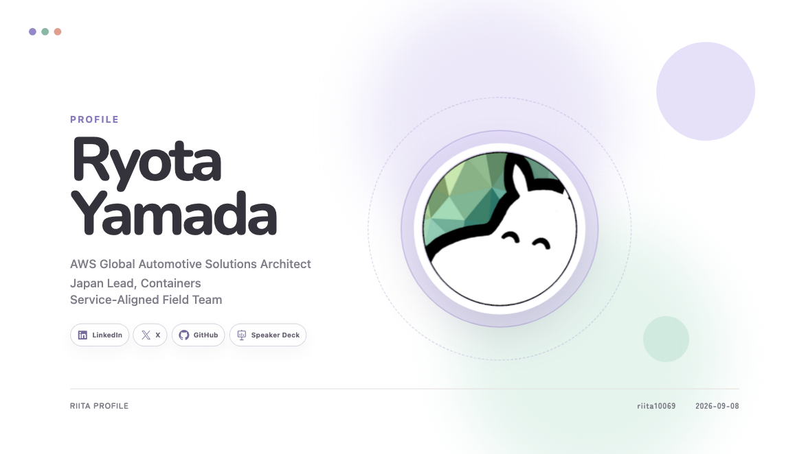
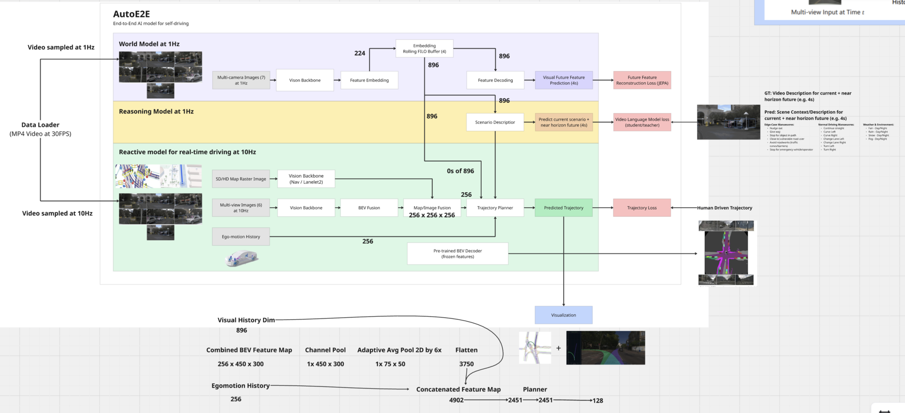
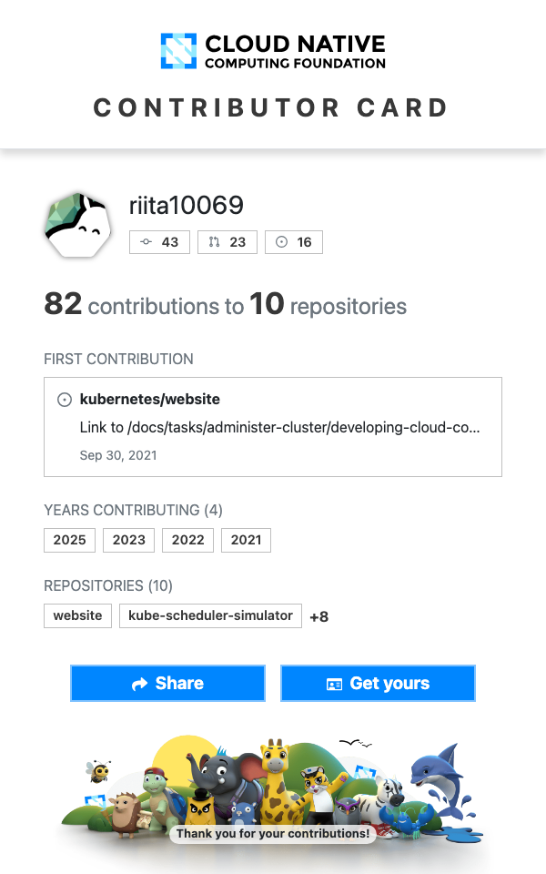

<div align="center">

<a href="https://talks.riita.people.aws.dev/profile/1">
  
</a>

<sub>▲ Click to open the <a href="https://talks.riita.people.aws.dev/profile/1"><b>self-introduction slides</b></a></sub>

<br /><br />

<a href="https://talks.riita.people.aws.dev/profile/1">
  
</a>

<br />

<a href="https://talks.riita.people.aws.dev/profile/1"></a>
<a href="https://talks.riita.people.aws.dev/"></a>
<a href="https://speakerdeck.com/riita10069"></a>
<a href="https://zenn.dev/riita10069"></a>
<a href="https://qiita.com/riita10069"></a>
<a href="https://x.com/riita10069"></a>
<a href="https://www.linkedin.com/in/riita10069/"></a>

</div>

---

## 👋 About me

```yaml
name:     Ryota Yamada (@riita10069)
company:  Amazon Web Services
location: Tokyo
roles:
  - Global Automotive Solutions Architect   # ADAS / AD · SDV
  - Japan Lead, Containers Service-Aligned Field Team   # Amazon EKS · Kubernetes
mission:  Empowering Future Mobility — SDV & Automated Driving
favorite: [Amazon EKS, AWS Distro for OpenTelemetry, Karpenter]
career:   2019 CTO / Tech Lead @ Startups → 2022 AWS Japan → 2024 AWS Global
hobbies:  [謎解き / マーダーミステリー, サッカー観戦, フットサル]
```

📽️ 詳しい自己紹介は **[Profile Slides](https://talks.riita.people.aws.dev/profile/1)** にまとめています。

## 🛠️ Tech Stack

<p align="center">
  
</p>

Formal methods with **TLA+**, config languages like **CUE**, and end-to-end autonomous driving models on **PyTorch**.

## 🚀 Open Source

### 🚗 Autoware — AutoE2E

**Robotaxi WG Tech Lead · Autoware Maintainer** — End-to-End 自動運転の技術方針、アーキテクチャ、Contributor Review を主導しています。

<p align="center">
  <a href="https://github.com/autowarefoundation/auto_e2e">
    
  </a>
</p>

<p align="center">
  <a href="https://github.com/autowarefoundation/auto_e2e"></a>
  <a href="https://github.com/autowarefoundation/auto_e2e"></a>
  <a href="https://autoware.org/"></a>
</p>

### ☸️ Kubernetes — Contributor Card

<p align="center">
  <a href="https://contribcard.cncf.io/riita10069">
    
  </a>
  &nbsp;&nbsp;
  <a href="https://github.com/search?q=author%3Ariita10069+org%3Akubernetes+org%3Akubernetes-sigs&type=pullrequests">
    
  </a>
</p>

## ✍️ Latest Articles

<!-- ZENN:START -->
- [Autoware Robotaxiの現在地（2026-09）](https://zenn.dev/riita10069/articles/autoe2e-map-oracle-route-temporal-bev)
- [Cosmos 3による自動運転動画の時系列シーンラベリング：公開ROADデータセットでの品質、誤りと推論費用の評価](https://zenn.dev/riita10069/articles/cosmos3-driving-video-scene-labeling)
- [PyTorchで理解する自動運転マルチカメラ統合の全体像](https://zenn.dev/riita10069/articles/auto-e2e-multi-view-fusion-explained)
- [【サーベイ】大規模言語モデル時代の「データ中心の自動運転モデル」](https://zenn.dev/riita10069/articles/survey_data-centric_autonomous-driving)
- [サービスメッシュの本質は、トラフィック管理や可観測性ではない](https://zenn.dev/riita10069/articles/service-mesh)
<!-- ZENN:END -->

<sub>Popular: [CUE言語(cuelang)に入門しよう](https://zenn.dev/riita10069/articles/plactice_cuelang) · [TLA+チートシート](https://zenn.dev/riita10069/articles/bc689cae1c7bc0) · [Cluster Autoscalerの挙動をざっくり理解する](https://zenn.dev/riita10069/articles/cluster_autscaler_from_source_code)</sub>

## 📊 GitHub Activity

<p align="center">
  
</p>

<div align="center">

<a href="https://talks.riita.people.aws.dev/profile/1"><b>→ See my profile slides</b></a>


</div>
